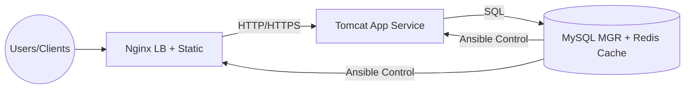

# 🏥 中州养老 (Zhongzhou Smart Care) - 运维实战项目


> 这是一个基于 CentOS 7/Stream 9 的分布式微服务架构部署项目。
> 包含了 Nginx 负载均衡、Tomcat 应用服务、MySQL 主从/MGR 集群、Redis 缓存以及 Ansible 自动化运维实践。

## ⭐ 项目价值与复杂度 (STAR)

* **情境 (Situation)**：养老业务对稳定性与数据一致性要求高，需要在有限预算下搭建可扩展的多节点运维体系。  
* **任务 (Task)**：设计并落地可复制的三节点微服务架构，覆盖负载均衡、应用服务、数据库高可用与自动化运维。  
* **行动 (Action)**：拆分 Node1/2/3 职责，落地 Nginx 反向代理、Tomcat 调优、MySQL 主从/MGR、Redis 缓存与 Ansible 自动化执行流程。  
* **结果 (Result)**：实现统一入口、自动化交付与高可用（HA，高可用性）能力，为业务提供稳定、可扩展且可运维的交付基线。  

## 📂 项目结构

```text
.
├── conf/           # 各节点核心配置文件 (Nginx, MySQL, Redis, Tomcat)
├── scripts/        # 运维 Shell 脚本 (自动备份, 监控, 一键部署)
├── sql/            # 数据库表结构 (Schema)
├── logs_sample/    # 运行日志样本 (Catalina, Nginx Access/Error)
└── static_assets/  # 前端静态资源目录结构列表
```

## 🏗️ 架构说明 (Architecture)



| 节点 | IP | 角色 | 部署软件 | 关键路径 |
| :--- | :--- | :--- | :--- | :--- |
| **Node1** | 192.168.88.101 | DB/Manage | MySQL 8.0, Redis, Ansible | `/var/lib/mysql` |
| **Node2** | 192.168.88.102 | App Server | Tomcat 9.0.100, JDK | `/opt/apache-tomcat-9.0.100` |
| **Node3** | 192.168.88.103 | Web/LB | Nginx (Yum) | `/var/www/dist` |

## 🔑 Key Features（自动化/可靠性/安全性/高可用）

* **自动化（Automation，自动化）**：以 Ansible 与脚本为核心，将部署、配置同步与收集流程固化为可重复执行的流程化动作。
* **可靠性（Reliability，可靠性）**：Nginx 反向代理 + Tomcat 调优 + 日志轮替，保证请求稳定与故障定位效率。
* **安全性（Security，安全性）**：SSH 免密与防火墙/安全组加固，减少人为误操作与暴露面。
* **高可用（HA，高可用性）**：MySQL Binlog + 主从/MGR、Redis 缓存分担热点读写，增强故障恢复与性能弹性。

## 🚀 Quick Start（脚本恢复环境最小步骤）

1. **准备三台节点**：配置与表格一致的 IP 与主机名，开启 SSH 互信（Node1 为控制端）。  
2. **获取项目**：`git clone` 后进入仓库，确认 `conf/`、`scripts/`、`sql/` 目录完整。  
3. **同步配置**：将 `conf/` 中对应节点配置复制到目标机器（例如 Node3 的 Nginx 配置、Node2 的 Tomcat 配置）。  
4. **恢复数据**：在 Node1 使用 `sql/` 中的 Schema 初始化数据库。  
5. **启动服务**：按 Node3 → Node2 → Node1 顺序启动 Nginx、Tomcat、MySQL/Redis，并执行 `scripts/` 中的自动化脚本完成收尾检查。  

---
*Generated by Hai Ting's Automation Script*
